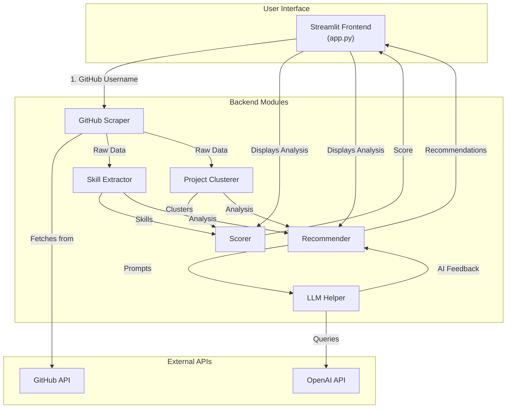

# 🚀 AI-Powered Data Science Portfolio Analyzer

[](https://www.python.org/downloads/)
[](https://streamlit.io/)
[](https://opensource.org/licenses/MIT)

An AI-powered application that evaluates a data scientist's GitHub portfolio. It analyzes repositories to detect skills, clusters projects into domains, scores the portfolio, and provides personalized, GPT-powered feedback for improvement.

## ✨ Features

- **GitHub Data Fetching**: Scrapes repository details including descriptions, languages, star counts, and README content.
- **Skill Extraction**: Parses project files to identify and list technical skills (e.g., Python, TensorFlow, Scikit-learn).
- **Project Clustering**: Uses sentence embeddings (BERT) and KMeans to automatically group similar projects into domains like NLP, CV, and Web Dev.
- **Comprehensive Scoring**: Calculates a portfolio score (0-100) based on weighted metrics.
- **AI-Powered Feedback**: Leverages GPT to generate a portfolio summary, suggest README improvements, and brainstorm new project ideas.
- **Personalized Recommendations**: Provides a custom learning path with suggestions for new skills to learn and courses to take.
- **Downloadable PDF Report**: Generates a clean, downloadable PDF summary of the entire analysis.

## 🏛️ Project Architecture

The application is built with a modular architecture, separating the frontend, backend logic, and external API interactions.



## 🧠 How the Scoring Works

The final portfolio score is a weighted average of four key components, each normalized to a 0-100 scale:

- **Tech Diversity (30%)**: Measures the breadth of unique technologies used across all projects. A wider range of skills scores higher.
- **Domain Diversity (30%)**: Measures the number of distinct project categories (e.g., NLP, Data Engineering). Encourages exploration of different fields.
- **Popularity (25%)**: A logarithmic score based on the total number of GitHub stars, reflecting community recognition.
- **README Quality (15%)**: A score based on the average length of README files, used as a proxy for documentation quality.

## 🛠️ Tech Stack

- **Frontend**: Streamlit
- **Backend**: Python
- **GitHub API**: PyGithub
- **NLP & Embeddings**: spaCy, NLTK, sentence-transformers
- **Clustering & ML**: Scikit-learn, UMAP
- **AI Feedback**: OpenAI API (GPT-3.5/4)
- **PDF Generation**: Jinja2, xhtml2pdf

---

## ⚙️ Setup and Installation

Follow these steps to run the application locally.

### 1. Prerequisites

- Python 3.8+
- A GitHub Personal Access Token (for higher API rate limits). [How to create one](https://docs.github.com/en/authentication/keeping-your-account-and-data-secure/managing-your-personal-access-tokens).
- An OpenAI API Key (for GPT-powered features). [Get one here](https://platform.openai.com/account/api-keys).

### 2. Clone the Repository
<details>
<summary>Click to expand</summary>

```bash
git clone <your-repository-url>
cd portfolio-analyzer
```
</details>

### 3. Create a Virtual Environment
<details>
<summary>Click to expand</summary>

```bash
# On Windows
python -m venv venv
venv\\Scripts\\activate

# On macOS/Linux
python3 -m venv venv
source venv/bin/activate
```
</details>

### 4. Install Dependencies
<details>
<summary>Click to expand</summary>

```bash
pip install -r requirements.txt
```
</details>

### 5. Set Environment Variables
<details>
<summary>Click to expand</summary>

Create a file named `.env` in the `portfolio_analyzer` directory and add your secret keys:

```
GITHUB_TOKEN="your_github_personal_access_token"
OPENAI_API_KEY="your_openai_api_key"
```

The application is coded to read these variables, but you can also set them directly in your system.
</details>

### 6. Run the Streamlit App
<details>
<summary>Click to expand</summary>

```bash
streamlit run app.py
```

The app should open in your default web browser.
</details>

---

## ☁️ Deployment

This application can be easily deployed for free on [Streamlit Community Cloud](https://streamlit.io/cloud).

1.  **Push to GitHub**: Make sure your project, including the `requirements.txt` file, is pushed to a public GitHub repository.
2.  **Sign up for Streamlit Cloud**: Log in with your GitHub account.
3.  **Deploy**: Click "New app", select your repository, and set the main file path to `portfolio_analyzer/app.py`.
4.  **Add Secrets**: In the advanced settings, add your `GITHUB_TOKEN` and `OPENAI_API_KEY` as secrets.
5.  Click "Deploy!"

## 🗺️ Roadmap

- [ ] **GitHub Growth Timeline**: Visualize repository creation dates to show portfolio growth over time.
- [ ] **Comparative Analysis**: Compare a user's portfolio against top open-source contributors.
- [ ] **"Ask the Mentor" Chatbot**: An interactive chatbot for career advice and coding questions.
- [ ] **User Authentication**: Add Firebase authentication to save and track analysis history.
- [ ] **CI/CD Integration**: Set up GitHub Actions for automated testing and deployment. 